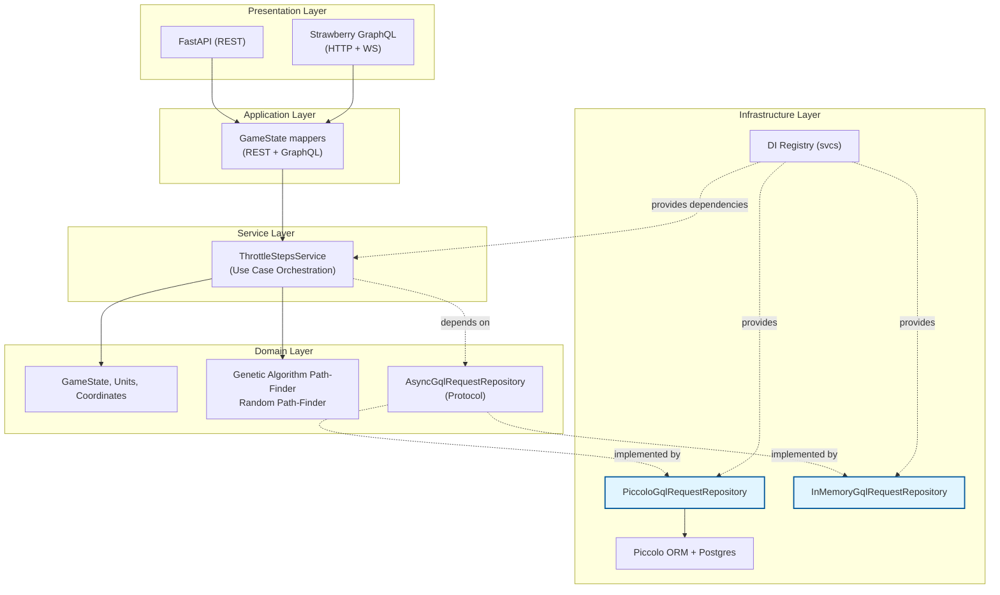

# Throttling Sequencer – FastAPI + Strawberry GraphQL Service

This repository represents a boilerplate fastapi service leveraging `svcs` for dependency injection and both rest and gql endpoints (using `strawberry`)
The code follows clean architecture best practices.

The example service exposes **REST** and **GraphQL** APIs for computing throttle paths for game-like units.
It also provides infrastructure for:

- Multi-database setup with **Piccolo ORM + asyncpg**
- DI-driven modular architecture using **svcs**
- Real-time navigation updates via **GraphQL subscriptions**
- Structured logging with **structlog**
- Local development in IDE or Docker
- Side topics: Demonstration for database failover simulations
  - locally with HAProxy
  - cloud based with AWS Aurora

---

## 1. High-Level Architecture

```
             ┌────────────────────────────────────────────┐
             │                Presentation                │
             │  - FastAPI (REST)                          │
             │  - Strawberry GraphQL (HTTP + WS)          │
             └────────────────────────────────────────────┘
                              │
                              ▼
             ┌────────────────────────────────────────────┐
             │             Application Layer              │
             │  - GameState mappers (REST + GraphQL)      │
             └────────────────────────────────────────────┘
                              │
                              ▼
             ┌────────────────────────────────────────────┐
             │         Service Layer (Use Cases)          │
             │         Pure - No Infrastructure           │
             │  - ThrottleStepsService                    │
             │    (Orchestrates domain logic)             │
             │    (DI injects dependencies, not service)  │
             └────────────────────────────────────────────┘
                              │
                              ▼
             ┌────────────────────────────────────────────┐
             │           Domain Layer (Pure Python)       │
             │  - GameState, Units, Coordinates           │
             │  - Genetic Algorithm Path-Finder           │
             │  - Random Path-Finder                      │
             │  - AsyncGqlRequestRepository (Protocol)    │
             └────────────────────────────────────────────┘
                              ▲
                              │
             ┌────────────────────────────────────────────┐
             │              Infrastructure Layer          │
             │  - PiccoloGqlRequestRepository            │
             │    (implements Protocol)                   │
             │  - InMemoryGqlRequestRepository            │
             │    (implements Protocol)                   │
             │  - Piccolo ORM + Postgres                  │
             │  - DI Registry (svcs)                      │
             └────────────────────────────────────────────┘
```

example dependency injection demonstration:




---

## 2. Technology Stack

| Area | Technology |
|------|------------|
| Web Framework | **FastAPI** |
| GraphQL | **Strawberry GraphQL** |
| Async DB | **asyncpg** |
| ORM | **Piccolo ORM** |
| Dependency Injection | **svcs** |
| Logging | **structlog** + Python logging |
| Runtime Server | **uvicorn** |
| Deployment | Docker (dev/prod targets) |
| Telemetry (placeholder) | OpenTelemetry API / SDK |
| Testing / Simulation | HAProxy failover scripts + AWS Aurora failover scripts |

---

## 3. Dependency Injection (svcs) – Architectural Overview

This project uses **`svcs`** as a *lightweight, explicit dependency injection container* to enforce **Clean Architecture / Hexagonal Architecture boundaries** while keeping runtime wiring flexible.

The DI setup is intentionally **boring and explicit**: no magic decorators, no implicit globals, no framework-driven injection into business logic.

### 3.1 Why `svcs`?

We use `svcs` because it:

* Encourages **constructor-based dependency injection**
* Keeps **application and domain layers framework-agnostic**
* Makes dependencies **explicit and testable**
* Integrates cleanly with **FastAPI lifespan**
* Avoids service locators *inside* business logic

Official reference:
[https://github.com/hynek/svcs](https://github.com/hynek/svcs)

---

### 3.2 High-Level DI Flow (Conceptual)

At runtime, dependency resolution follows this direction:

```
FastAPI lifespan
    ↓
svcs.Registry (factories & values registered)
    ↓
svcs.Container (request / lifespan scoped)
    ↓
Application services (ThrottleStepsService, etc.)
    ↓
...
```

Key principle:

> **Only the composition root knows about `svcs`.
> Business logic never does.**

---

### 3.3 Composition Root

The **only place where dependencies are wired together** is the *composition root*:

```
throttling_sequencer/di/fastapi_lifespan.py
throttling_sequencer/di/services.py
```

This is a deliberate design choice to keep all infrastructure knowledge localized.

### 3.4 FastAPI Lifespan Integration

`svcs` is integrated using FastAPI’s lifespan mechanism:

```python
@svcs.fastapi.lifespan
async def di_lifespan(app: FastAPI, registry: svcs.Registry):
    adjust_registry(registry)
    yield
```

Responsibilities of the lifespan:

* Start infrastructure resources (database pool)
* Populate the DI registry
* Shut down resources gracefully

No business logic is executed here.

---

### 3.5 Registry: Wiring, Not Logic

The **registry** maps *abstractions to implementations*.

Located in:

```
throttling_sequencer/di/services.py
```

Examples of what gets registered:

* **Protocols → concrete implementations**
* **Configuration objects → singleton values**
* **Factories → services with dependencies**

Important characteristics:

* The registry contains **no business logic**
* Factories are simple object constructors
* Swapping implementations requires changing only the registry

This enables easy replacement of:

* Path-finding algorithms
* Repositories (Piccolo ↔ in-memory)
* Configuration strategies

---

### 3.6 Dependency Direction (Clean Architecture)

The DI setup strictly respects dependency direction:

```
API layer
  → Application services
      → Domain logic
          ← Repository interfaces (Protocols)
              ← Infrastructure implementations
```

Key points:

* **Domain defines interfaces** (e.g. `AsyncGqlRequestRepository`)
* **Infrastructure implements them**
* **DI binds the two at runtime**
* The domain never imports infrastructure
* The service layer depends only on abstractions

This is classic **hexagonal architecture (ports & adapters)**.

---

### 3.7 Services Are Constructed, Not Looked Up

Application services (e.g. `ThrottleStepsService`) receive dependencies **via constructors**, not via the container:

```python
class ThrottleStepsService:
    def __init__(self, path_finder: PathFinder):
        self.path_finder = path_finder
```

The service:

* Does not know what `svcs` is
* Does not know where `PathFinder` comes from
* Is trivially testable with a fake or stub

This avoids the *Service Locator anti-pattern*.

---

### 3.8 Runtime Variability Without Code Changes

Because dependencies are resolved at runtime:

* You can switch path-finding strategies
* You can replace repositories
* You can use in-memory implementations for tests

All **without changing application or domain code**.

Only the registry changes.

---

### 3.9 Non-FastAPI Usage (Explicit Container)

For non-HTTP execution paths (scripts, experiments), the project exposes an **explicit container builder**:

This is intentionally:

* Explicit
* Isolated from FastAPI
* Useful for CLI tools or experiments
* Helps us to avoid building dependency container monsters that are used for different purposes (e.g. you will use a smaller scope DI container for e2e tests than for the fastapi service)

This does **not** affect the main FastAPI runtime.

---

## 4. Running the Service

### 4.1. Running locally from your IDE

Use this env file:

```
configuration/local_or_ide/local_development.env
```

Run the service:

```
python throttling_sequencer_fastapi/manage.py
````

This executes `manage.py`, which:

- Loads Uvicorn settings (`UvicornServerConfig`)
- Loads JSON log config
- Runs uvicorn in factory mode

### 4.2. Running with Docker (Development Mode)

Inside `throttling_sequencer_fastapi` run:

```sh
docker build --target dev -t throttling_seq:local_dev -f ./Dockerfile .
````

Run the container with local development env:

```sh
docker run -it -p 8080:8080 \
  --env-file configuration/docker/local_development.env \
  --rm throttling_seq:local_dev
```

To get a shell inside:

```sh
docker run -it --rm throttling_seq:local_dev /bin/bash
```

### 4.3. Running with Docker (Production Mode)

```sh
docker build --target prod -t throttling_seq:local_prod -f ./Dockerfile .
docker run -p 8080:8080 throttling_seq:local_prod
```

---

## 5. Environment Files

Different execution models require different env files:

| Env file                             | Used for                          |
| ------------------------------------ | --------------------------------- |
| `local_or_ide/local_development.env` | Running from IDE                  |
| `docker/local_development.env`       | Running from Docker dev container |
| Production envs                      | Provided by infrastructure        |

All env vars follow the pydantic-settings conventions:

* `uvicorn_...` → configure uvicorn
* `piccolo_...` → configure DB host/user/password
* `piccolo_db_run_migrations=true` to auto-run Piccolo migrations

---

## 6. Database Layer

### ORM: Piccolo

* Tables live under
  `infrastructure/db/piccolo_throttling_sequencer_app`
* Piccolo migrations run automatically if
  `piccolo_db_run_migrations=true`

### Connection Pool

Pool config in
`piccolo_throttling_sequencer_app/pool_config.py`

### Repositories

Two implementations exist:

| Repository                     | When used                       |
| ------------------------------ | ------------------------------- |
| `PiccoloGqlRequestRepository`  | Default (real Postgres)         |
| `InMemoryGqlRequestRepository` | Can be toggled in `services.py` |

---

## 7. Multi-Database Setup + Failover

This project has built-in tooling to simulate Postgres failovers.

### Option A — HAProxy local failover

Script:
`testing_payloads/multi_db_flip.sh`

You can:

* Drain DB1 → promote DB2
* Drain DB2 → promote DB1
* Force both down
* Bring up DBs in arbitrary order

This is useful to validate:

* asyncpg reconnect behavior
* Piccolo connection pool rotation
* Repository retry logic
* Request routing stability

### Option B — AWS Aurora Failover via SSM Bastion

Scripts:

* `aws_rds_port_forward_failover_sequence.sh`
* Notes: `aws_failover_notes.md`

Supports:

* SSM port-forwarding from local machine → Bastion → Aurora cluster
* Trigger Aurora failover via the AWS CLI
* Automatically restart tunnels
* Observe read/write node changes

---

## 8. API Overview

### REST (FastAPI)

Base URLs:

```
/api/v1/health
/api/v1/throttle/calculate_throttle_steps
```

Request body: `GameStateDto`
Response: list of `UnitGoalDto`

### GraphQL (Strawberry)

HTTP endpoint:

```
/graphql
```

Subscriptions via WebSocket:

Supports both:

* `graphql-ws`
* `graphql-transport-ws`

Example subscription script:
`testing_payloads/gql_websocket.py`

---

## 9. Logging

Structured logging with:

* `structlog`
* JSON logging via uvicorn’s config

Every request is enriched with:

* `request_id`
* `user_id`
* (optionally) trace_id if using OpenTelemetry

Middleware:

* `CustomAuthenticationMiddleware`
* `LogContextMiddleware`

---

## 10. Testing Payloads

Inside `testing_payloads/`:

| Script                                      | Purpose                                     |
| ------------------------------------------- | ------------------------------------------- |
| `gql_curl.sh`                               | Send GraphQL queries                        |
| `gql_websocket.py`                          | Test GraphQL subscriptions                  |
| `game_state.json`                           | Example REST payload                        |
| `aws_rds_port_forward_failover_sequence.sh` | Run Aurora failover                         |
| `multi_db_flip.sh`                          | Flip between local DB instances via HAProxy |
| `graphql_api_poller.sh`                     | Stress test GraphQL endpoint                |

---

## 11. Production Notes

* Recommended: run behind HAProxy or Envoy
* For Aurora: use cluster endpoint for write routing
* Piccolo migrations should not be run automatically in prod
* Configure OTel tracers inside `core/telemetry.py`

---

## 12. License

Internal project – no license defined yet.